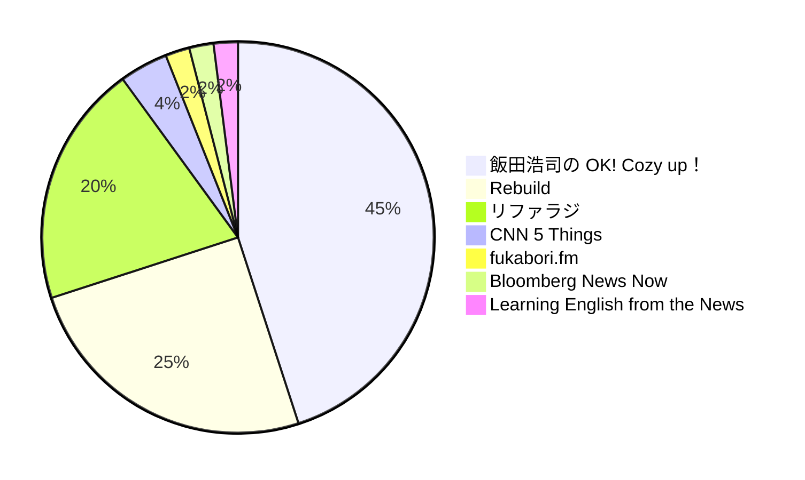

# Podcast

## ❖ Technology

- [リファクタリングとともに生きるラジオ](https://open.spotify.com/show/6AFwFRkCSTg775uOEfBLNF?si=ba389ec60a534ba1)
- [Rebuild](https://open.spotify.com/show/4zqDMbg9WSpC5l81gJCfEc?si=bc0a22e0d3334bc4)
- [fukabori.fm](https://open.spotify.com/show/2gEI6bMbrBhXnpi6AVs8qp?si=ed938d7ca4ec450d)

## ❖ News

- [飯田浩司の OK! Cozy up！ Podcast](https://open.spotify.com/show/7aW9vJ7lztRss2YsqzKBhn?si=9f80d17ec6e34f4c)
- [CNN 5 Things](https://open.spotify.com/show/1xGSLDgVYxLybmXpui6wwo?si=d31e796674464898)
- [Bloomberg News Now](https://open.spotify.com/show/5q8wg5rFYbbeDk0kk7t6Uc?si=dd638c2be7b84f59)
- [Learning English from the News](https://open.spotify.com/show/6NZfBr3wPP7DD3uzQCGgFA?si=5848ef0f56e4413d)

## ❖ Ratios

